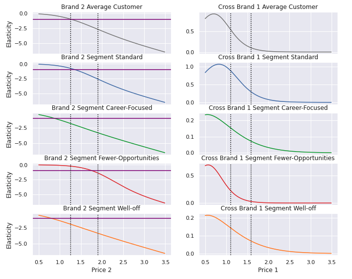
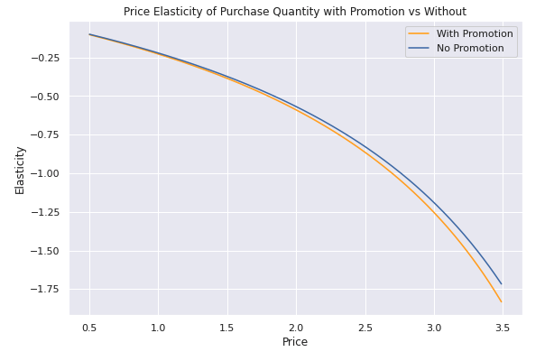

# Problem Statement:
* The information contained comes from the purchasing behavior of 2000 individuals when entering a physical FMC store, all data has been collected through the loyalty cards they use at checkout. We have pre-processed the data, encoded all variables numerically and dealt with missing values. In addition, we have restricted the volume of the data set and protected the privacy of the customers.
* The purchase data was recorded at each time of purchase and does not contain all days for the past two years. It does include multiple entries for customers. The goal of the positioning portion is to use the segmentation information to accurately predict purchase probability, brand choice probability, and purchase quantities.

# 1. Customer Segmentation
### Methods Used:
* Hierarchical Clustering, K-means, PCA

## A) EDA:
#### Initial Analysis:
* Customers could be segmented into four different groups.
* By taking the average values for each feature per group we were able to further classify these groups as:
  - Well Off: Older, highest education, highest income
  - Fewer Opportunities: Unmarried, lowest income, lowest occupation, small city
  - Career Focused: Unlikely to be married, high income, high occupation, big city
  - Standard: Married, younger, good education, good income

#### Further we can see just how much of our customer base is made of up of each segment:

#### Each segment can be discribed by three components:

#### We can see that the components are correlated with certain features:
* Component 1: Career Focus (age, education, income, occupation, city size)
* Component 2: Education-Lifestyle (sex, marital status, age, education)
* Component 3: Experience (marital status, age, occupation)

# 2. Product Positioning
## A) Understanding the Purchase Data
Customer base for this store:

How often they buy:

Which brand they buy:

#### The majority of this store's customers come from the Fewer-Opportunities segment which makes a purchase 20% of the time they are in the store and almost exclusively buy Brand 2.
* Hypothesis: Lowering price on Brand 2 or providing promotions will increase sales and purchase frequency for this segment.

# B) Calculating Probabilities

## 1) Purchase probability
* Price elasticity of purchase probability
  - How sales are effected by price change for product
*
### Model: Binomial logistic regression
  * This model was used in other sections to predict the probability of purchase for a range of prices below and above the observed price range.

### a) Price elasticity

- Measures the percent change in purchase probability for change in price
  * Around $1.25 slope crosses y=-1 and decreases rapidly becoming elastic.
  * Prices below $1.25 may be changed without expected change in customer buying patterns on average.

### b) Purchase Probability by Segment

The point at which customer segments will be affected by price change:
* Well-Off: $1.47
* Fewer-Opportunities: $1.27
* Standard: $1.23
* Career-Focused: $1.39

### c) Purchase Probability with/without promotion
* We took average price and promotion since we are looking at the overall effect of promotions on elasticities. This could later be fine tuned to get a more granular outlook on effects.
* From the chart below, we see that promotions are consistently less elastic than no promotions.
*   **The store would do better to consistently have higher prices with promotions than to have lower regular prices.**

## 2) Brand choice
* Price elasticity of brand choice probability
  - How sales are effected by price change of product brand only

### Model: Multinomial Logistic Regression

#### Figure 1: Shows that Brand 2 and Brand 1 are substitutes for each other since elasticity is positive.

#### Figure 2: Own Brand and Cross Brand Elasticities

* The intersection of the chart and the horizontal purple line denotes the point at which each chart becomes elastic.
* The vertical dotted lines show the boundaries of the observed prices for Brand 2 (left charts) and Brand 1 (right charts) respectively.
* We can see that Well-off and Career-Focused are not the target market.
  - These segments do not buy enough of Brand 2 to accurately report and show a sense of "false customer loyalty"
* Both the Standard and Fewer-Opportunities segments are inelastic within the observed range.

#### Figure 3: Price Comparisons

#### Example:
**Brand 2 price is $1.34 and Brand 1 price is $1.12**
* For the Fewer-Opportunities segment we see that our own brand elasticity (Brand 2 = $1.34) is -.293 and our cross brand elasticity with (Brand 1 = $1.12) is .212
* This means that if Brand 1 lowers their price by 1% the our probability of a sale for Brand 2 decreases by .212%
  - However, if we lower our price by 1% as well we pick up a market share of .081% (.293 - .212)
  - To minimize price reduction we can drop our price of Brand 2 by half of the cross brand elasticity (.212/2) = .106% and have zero loss in sales probability.

## 3) Price Elasticity of Purchase Quantity

* On average purchase quantities are slightly more elastic with promotions. This is a general overview of purchase quantity price elasticity. More in-depth modeling can be done to specify brand and customer segment. This is outside the scope of this project, but may be added later on.
